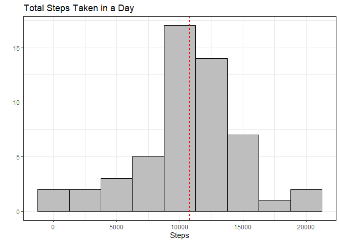
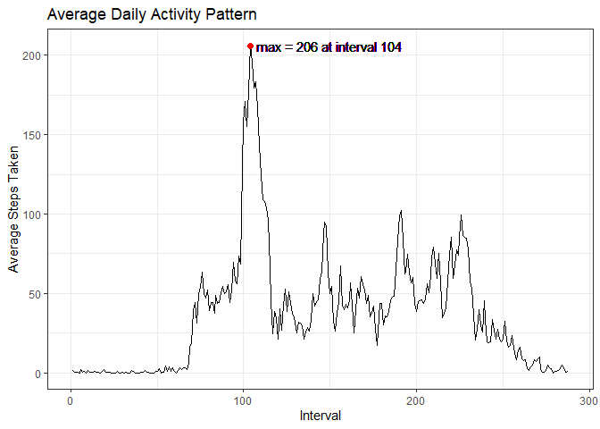
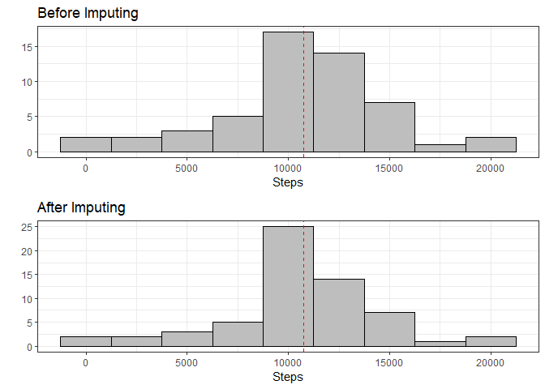
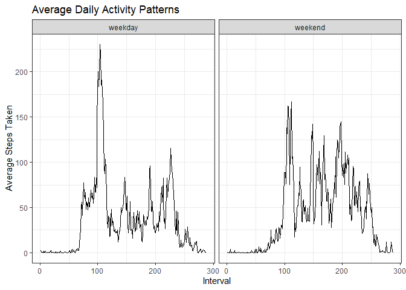

---
output:
  html_document:
    keep_md: yes
---
Reproducible Research Peer Assignment 1
========================================

The data for this assignment come from a personal activity monitoring device
that records the number of steps someone takes at 5 minute intervals. It was 
collected from one individual over 2 months, October and November 2012.

### Loading and preprocessing the data

The data comes as a zipped file and must be unzipped. It can then be read into R
with read.csv()


```r
unzip("activity.zip")
activityData <- read.csv("activity.csv", header = TRUE)
head(activityData, 5)
```

```
##   steps       date interval
## 1    NA 2012-10-01        0
## 2    NA 2012-10-01        5
## 3    NA 2012-10-01       10
## 4    NA 2012-10-01       15
## 5    NA 2012-10-01       20
```

We can see that there are 3 columns: steps, date, and interval. The date column 
comes as a character vector and the interval column, which represents the time
of day, is a numeric vector. It would be helpful for both of these to be
converted into datetime format. We can do this with the lubridate package as
well as some string editing on the interval column.


```r
#Convert date column into date format and the interval column into time format
library(lubridate)
activityData$date <- ymd(activityData$date)

activityData$interval <- as.character(activityData$interval)
activityData$interval <- sub("^(\\d)$", "00:0\\1", activityData$interval)
activityData$interval <- sub("^(\\d{2})$", "00:\\1", activityData$interval)
activityData$interval <- sub("^(\\d)(\\d{2})$", "0\\1:\\2", activityData$interval)
activityData$interval <- sub("^(\\d{2})(\\d{2})$", "\\1:\\2", activityData$interval)
activityData$interval <- hm(activityData$interval)

#Add a datetime column
activityData$datetime <- activityData$date + activityData$interval
head(activityData, 5)
```

```
##   steps       date interval            datetime
## 1    NA 2012-10-01       0S 2012-10-01 00:00:00
## 2    NA 2012-10-01    5M 0S 2012-10-01 00:05:00
## 3    NA 2012-10-01   10M 0S 2012-10-01 00:10:00
## 4    NA 2012-10-01   15M 0S 2012-10-01 00:15:00
## 5    NA 2012-10-01   20M 0S 2012-10-01 00:20:00
```

### What is the mean total number steps taken per day?

To answer this, we can easily use the dplyr package to group the data by date and
find the daily sum of steps taken. We then can calculate the mean and median of that
data.


```r
library(dplyr)
dailySums <- activityData %>% group_by(date) %>%
    summarize(dailySum = sum(steps))

dailySums %>% summarize(mean = mean(dailySum, na.rm = TRUE),
                        median = median(dailySum, na.rm = TRUE))
```

```
## # A tibble: 1 x 2
##     mean median
##    <dbl>  <int>
## 1 10766.  10765
```

We can also make a histogram of the daily sum of steps to get a better sense of 
the distribution of the data. I also added a red dashed line at the mean.


```r
library(ggplot2)
hist1 <- dailySums %>% ggplot(aes(dailySum)) +
    geom_histogram(binwidth = 2500, fill = "gray", col = "black") +
    geom_vline(aes(xintercept = mean(dailySum, na.rm = TRUE)), col = "red", lty = 2) +
    labs(x = "Steps", y = "", title = "Total Steps Taken in a Day") +
    theme_bw()
print(hist1)
```

<!-- -->

### What is the average daily activity pattern?

This can be shown with a line graph of the average steps grouped by interval. Giving
each interval an index (1-288) makes it clearer to plot than the. 


```r
intervalMeans <- activityData %>% group_by(interval) %>%
    summarize(meanSteps = mean(steps, na.rm = TRUE)) %>%
    mutate(index = 1:288)
ggplot(data = intervalMeans, aes(index, meanSteps)) +
    geom_line() +
    geom_point(aes(104, 206), col = "red", size = 2) +
    geom_text(aes(150, 206), label = "max = 206 at interval 104", col = "black") +
    labs(x = "Interval", y = "Average Steps Taken",
         title = "Average Daily Activity Pattern") +
    theme_bw()
```

<!-- -->

We can also find which interval has the highest average steps.


```r
intervalMeans[which.max(intervalMeans$meanSteps),]
```

```
## # A tibble: 1 x 3
##   interval  meanSteps index
##   <Period>      <dbl> <int>
## 1 8H 35M 0S      206.   104
```

As we can see, the highest average steps occurs at the 104th interval which corresponds
to the reading taken at 8:35AM.

### Imputing missing values

There are many rows with missing values in this data set which may be skewing the 
calculations and summaries.


```r
sum(is.na(activityData$steps))
```

```
## [1] 2304
```

We see that there are 2304 missing values. This is exactly 8 days of missing values
since each day has 288 entries. To fill in these missing values, we can use the
mean of each interval to essentially have each missing day be an "average" day.


```r
#Find the days with missing data
missing <- unique(activityData$date[is.na(activityData$steps)])

#Make a vector with the new data
newData <- rep(intervalMeans$meanSteps, 8)

#Create a data set of filled in data
filledDates <- activityData %>%
    filter(date %in% missing) %>%
    mutate(steps = newData)

#Replace the incomplete rows with the newly filled rows
filledData <- activityData
filledData[is.na(filledData$steps), ] <- filledDates

#Check for NAs
sum(is.na(filledData$steps))
```

```
## [1] 0
```

We can now remake our previous histogram of total steps taken per day, as well as 
the mean and median, and compare them to see how imputing might have changed these
summaries.


```r
newDailySums <- filledData %>% group_by(date) %>%
  summarize(dailySum = sum(steps))

newDailySums %>% summarise(mean = mean(dailySum), median = median(dailySum))
```

```
## # A tibble: 1 x 2
##     mean median
##    <dbl>  <dbl>
## 1 10766. 10766.
```

The mean and median are relatively unaffected. The only change is that the median
has now gone up by 1.


```r
hist2 <- newDailySums %>% ggplot(aes(dailySum)) +
    geom_histogram(binwidth = 2500, fill = "gray", col = "black") +
    geom_vline(aes(xintercept = mean(dailySum)), col = "red", lty = 2) +
    labs(x = "Steps", y = "", title = "After Imputing") +
    theme_bw()
library(ggpubr)
ggarrange(hist1 + ggtitle("Before Imputing"), hist2, nrow = 2, ncol = 1)
```

<!-- -->

The only change to the histograms is that the bin containing the mean has a
higher frequency. This makes sense since we imputed in 8 days that have exactly
the average amount of steps at every interval.

### Are there differences in activity patterns between weekdays and weekends?

To look for differences in activity from weekdays to weekends, we start by creating
a variable to indicate whether each date is a weekday or weekend. We can then group
our data by that variable and find the average steps taken at each interval.


```r
weekdayData <- filledData %>% mutate(weekday = weekdays(date)) %>%
    mutate(dayOrEnd = factor(ifelse(weekday %in% c("Saturday", "Sunday"), "weekend", "weekday"))) %>%
    select(-weekday)

grpIntervalMeans <- weekdayData %>% group_by(dayOrEnd, interval) %>%
    summarize(meanSteps = mean(steps)) %>% ungroup() %>% mutate(index = rep(1:288, 2))
```

We can now plot the results on separate line graphs to view the different trends.


```r
ggplot(data = grpIntervalMeans, aes(index, meanSteps)) +
    geom_line() +
    labs(x = "Interval", y = "Average Steps Taken", title = "Average Daily Activity Patterns") +
    facet_grid(. ~ dayOrEnd) +
    theme_bw()
```

<!-- -->

This plot shows that on weekends, the morning peak is generally lower than on weekdays.
However, weekends have more consistent high peaks while weekdays have very few
peaks beyond the morning peak.
